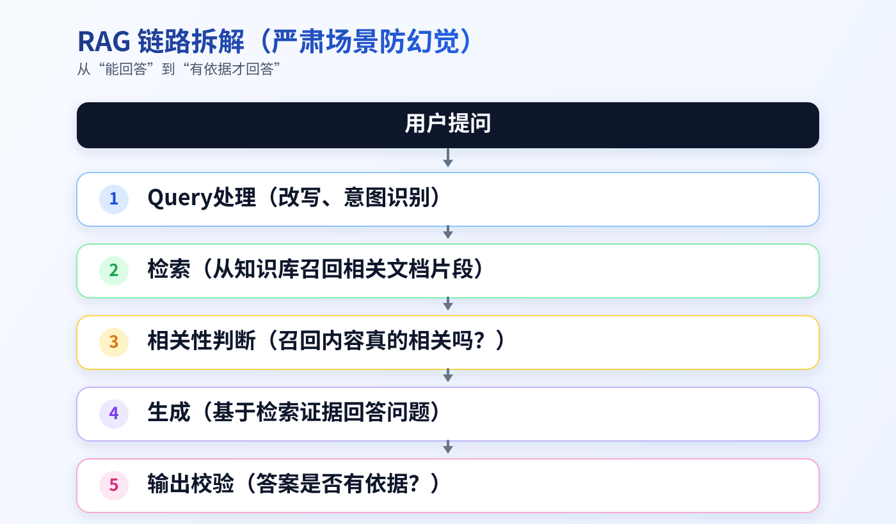
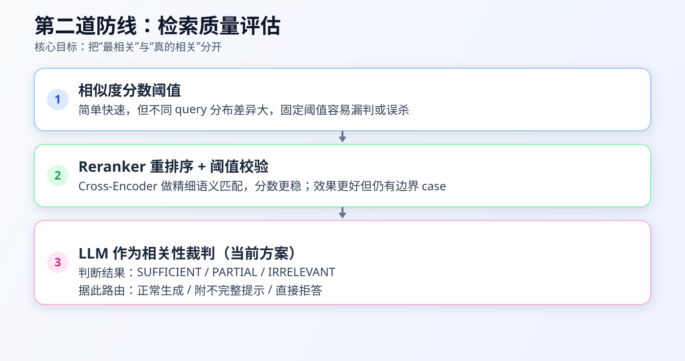
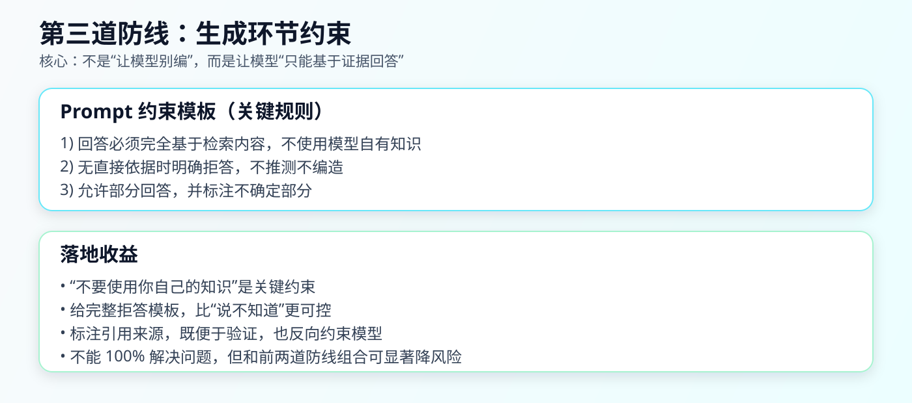
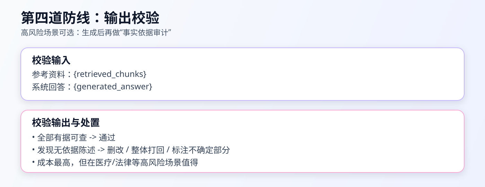
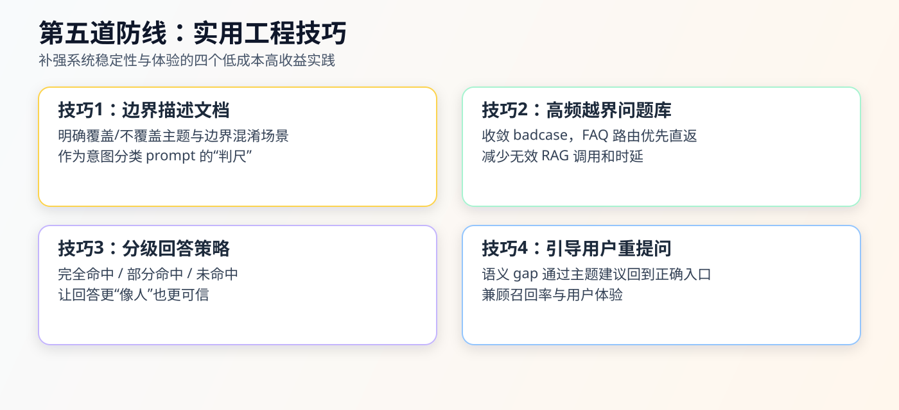

# 第一节 RAG 项目中的幻觉治理：五道防线与工程落地

> 本文基于“混合RAG到图RAG阶段”的项目实践，整理一套可直接落地的幻觉治理方案。文中代码均为伪代码/示例代码，重点在策略设计与工程组织。

## 一、问题定义与链路拆解

### 1.1 什么是“幻觉”（hallucination）

在 RAG 场景中，幻觉通常指：模型输出看似合理、语言流畅，但缺乏检索证据支撑，或与知识库事实不一致。

更常见的情况是“检索失败型幻觉”：系统没有召回足够相关内容，但模型仍然尝试补全答案，导致事实不可靠。

### 1.2 为什么要拆解整条链路

要降低严肃场景中的幻觉率，不能只盯着“生成阶段”，而要把 RAG 全链路拆开看：

`用户提问 -> Query处理（改写、意图识别） -> 检索 -> 相关性判断 -> 生成 -> 输出校验`



### 1.3 防线总览

- 第一道防线：意图识别与边界判断，先拦越界问题。
- 第二道防线：检索质量评估，判断“召回是否可答”。
- 第三道防线：生成约束，要求只基于证据回答。
- 第四道防线：输出校验，再做一次“有据可查”检查。
- 第五道防线：工程技巧，持续优化线上 badcase。
- 第六层（底座层）：知识库质量治理，决定上限。

## 二、第一道防线：意图识别与边界判断

第一道防线的目标很直接：越界问题尽量不要进入检索和生成链路。

### 2.1 基于规则的边界判断

如果知识库边界明确（例如内部 IT 运维知识库），对于“今天天气怎么样”“我想吃什么”这类明显越界问题，可以直接拦截并返回固定话术。

> 代码示例：[rule_boundary_guard.py](./code/rule_boundary_guard.py)

```python
import re
from dataclasses import dataclass

@dataclass
class GuardResult:
    allow: bool
    reason: str
    reply: str = ""

OUT_PATTERNS = [
    r"天气|气温|下雨|下雪",
    r"吃什么|推荐.*餐厅|菜谱",
    r"写(一首)?诗|讲(个)?笑话|星座|运势",
]

IN_HINTS = [
    "vpn", "账号", "密码", "域控", "服务器", "监控", "告警",
    "工单", "发布", "回滚", "日志", "网络", "权限", "堡垒机"
]

def rule_boundary_check(query: str) -> GuardResult:
    q = query.strip().lower()

    if any(re.search(p, q) for p in OUT_PATTERNS):
        return GuardResult(
            allow=False,
            reason="rule_out_of_scope",
            reply="当前助手仅支持公司IT运维相关问题（账号、网络、发布、告警、权限等）。"
        )

    if any(k in q for k in IN_HINTS):
        return GuardResult(allow=True, reason="rule_in_scope")

    return GuardResult(allow=True, reason="rule_uncertain")
```

### 2.2 高频越界问题：FAQ 路由

线上越界问题往往高度重复。将高频问题做成 FAQ 路由，命中后直接返回，不再进入 RAG。

> 代码示例：[faq_ood_router.py](./code/faq_ood_router.py)

```python
import re

FAQ_OOD = [
    {"patterns": [r"你是谁", r"你能做什么"], "reply": "我是公司IT运维知识助手，主要回答账号、网络、发布、告警等问题。"},
    {"patterns": [r"天气", r"气温"], "reply": "我不提供天气服务，请咨询天气应用。"},
    {"patterns": [r"吃什么", r"餐厅"], "reply": "我不提供餐饮推荐，请提出IT运维相关问题。"},
]

def ood_faq_route(query: str):
    q = query.strip().lower()
    for item in FAQ_OOD:
        if any(re.search(p, q) for p in item["patterns"]):
            return {"hit": True, "reply": item["reply"], "route": "faq_ood"}
    return {"hit": False}
```

### 2.3 用 LLM 做意图分类

对规则无法明确判断的问题，让 LLM 先做一次范围分类：`IN_SCOPE / OUT_OF_SCOPE / UNCERTAIN`。

> 代码示例：[llm_intent_classifier.py](./code/llm_intent_classifier.py)

```python
from openai import OpenAI
import os

client = OpenAI(
    api_key=os.getenv("GEMINI_API_KEY"),
    base_url="https://generativelanguage.googleapis.com/v1beta/openai/"
)

SYSTEM_PROMPT = """
你是意图分类器。只输出一个标签：
- IN_SCOPE：属于公司IT运维知识范围
- OUT_OF_SCOPE：明显不属于
- UNCERTAIN：不确定

范围示例：账号、权限、VPN、网络、发布、回滚、告警、日志、服务器、数据库运维。
"""

def llm_intent_classify(query: str) -> str:
    resp = client.chat.completions.create(
        model="gemini-2.5-flash",
        temperature=0,
        max_tokens=8,
        messages=[
            {"role": "system", "content": SYSTEM_PROMPT},
            {"role": "user", "content": f"用户问题：{query}\\n只返回标签。"}
        ]
    )
    label = (resp.choices[0].message.content or "").strip().upper()
    if label not in {"IN_SCOPE", "OUT_OF_SCOPE", "UNCERTAIN"}:
        return "UNCERTAIN"
    return label
```

### 2.4 推荐串联调用

建议顺序：`FAQ路由 -> 规则边界 -> LLM分类`。

> 代码示例：[pre_guard_pipeline.py](./code/pre_guard_pipeline.py)

```python
def pre_guard(query: str):
    faq = ood_faq_route(query)
    if faq["hit"]:
        return {"allow": False, "reply": faq["reply"], "route": faq["route"]}

    r = rule_boundary_check(query)
    if not r.allow:
        return {"allow": False, "reply": r.reply, "route": r.reason}

    if r.reason == "rule_uncertain":
        label = llm_intent_classify(query)
        if label == "OUT_OF_SCOPE":
            return {"allow": False, "reply": "该问题超出IT运维知识库范围。", "route": "llm_out_scope"}
        if label == "UNCERTAIN":
            return {"allow": True, "route": "llm_uncertain"}

    return {"allow": True, "route": "in_scope"}
```

## 三、第二道防线：检索质量评估

这是整个方案最核心、也最容易被忽略的一层。

RAG 会返回 Top-K“最相关”片段，但“最相关”不等于“真的相关”，更不等于“足够回答问题”。

向量检索的机制决定了：几乎任何 query 都会召回一些“最接近”的内容，即使这些内容和问题本身并不真正匹配。



### 3.1 方案一：相似度阈值门控

最直观方案是给向量分数设阈值，低于阈值判为不相关。

- 优点：简单、便宜、延迟低。
- 缺点：分数分布随 query 波动大，固定阈值容易漏判或误杀。

> 代码示例：[relevance_threshold_gate.py](./code/relevance_threshold_gate.py)

```python
from relevance_threshold_gate import is_retrieval_relevant_by_threshold

scores = [0.21, 0.33, 0.41]
passed = is_retrieval_relevant_by_threshold(scores, threshold=0.5)
print(passed)  # False
```

### 3.2 方案二：Reranker 重排序 + 分数校验

在向量 Top-K 后增加 Cross-Encoder Reranker，再对最高分做阈值判断。

- 优点：比原始向量分数更可靠。
- 缺点：仍存在边界 case，且成本更高。

> 代码示例：[reranker_score_gate.py](./code/reranker_score_gate.py)

```python
from reranker_score_gate import rerank_and_gate

docs = ["文档A", "文档B", "文档C"]
scores = [0.18, 0.42, 0.31]
top, ok = rerank_and_gate("VPN连不上", docs, scores, threshold=0.4)
print(top, ok)
```

### 3.3 方案三：LLM 作为相关性裁判（当前主方案）

在检索和重排后，把 Top-K 与原问题一起输入 LLM，让模型判断：这些内容是否真的足够回答用户问题。

标签定义：

- `SUFFICIENT`：信息足够。
- `PARTIAL`：部分相关但不完整。
- `IRRELEVANT`：基本无关。

简化 prompt：

```text
你是一个相关性判断助手。

用户的问题是：{query}

以下是从知识库中检索到的内容片段：
---
{chunk_1}
---
{chunk_2}
---
{chunk_3}
---

请判断：以上检索到的内容是否包含了能够回答用户问题的信息？

- SUFFICIENT：检索内容中包含足够的信息来回答问题
- PARTIAL：检索内容中包含部分相关信息，但不足以完整回答
- IRRELEVANT：检索内容与用户问题基本无关

请输出 JSON：
{"label":"SUFFICIENT|PARTIAL|IRRELEVANT", "reason":"简短理由"}
```

路由动作：

- `SUFFICIENT`：正常进入生成。
- `PARTIAL`：进入生成，但明确标注“信息可能不完整，仅供参考”。
- `IRRELEVANT`：不进入生成，直接拒答。

> 代码示例：[llm_relevance_judge.py](./code/llm_relevance_judge.py)

```python
from llm_relevance_judge import llm_relevance_judge

query = "这套系统支持哪些运维告警策略？"
chunks = ["片段A", "片段B", "片段C"]
result = llm_relevance_judge(query, chunks)
print(result)
```

### 3.4 推荐串联调用

建议按“低成本优先”串联：

`阈值门控 -> Reranker校验 -> LLM裁判 -> 生成路由`

> 代码示例：[retrieval_quality_router.py](./code/retrieval_quality_router.py)

```python
from retrieval_quality_router import retrieval_quality_router

result = retrieval_quality_router(
    query="量子力学是什么",
    dense_scores=[0.62, 0.48, 0.44],
    candidates=["古代天文学条目", "天体运动条目", "物质概念条目"],
    reranker_scores=[0.22, 0.19, 0.21],
)
print(result)
```

## 四、第三道防线：生成环节的约束

前两道防线做完后，仍可能有漏网问题：看起来“在范围内”，也召回了“像相关”的片段，但仍不足以直接回答。

第三道防线的目标是把约束写具体，让模型只在证据范围内回答。



### 4.1 约束 Prompt（简化版）

```text
请严格基于以下参考内容来回答用户的问题。

重要规则：
1. 你的回答必须完全基于下方提供的参考内容，不要使用你自己的知识
2. 如果参考内容中没有直接涉及用户问题的信息，请明确告知用户
   “根据我所掌握的资料，暂时无法回答这个问题”，不要尝试推测或编造
3. 如果参考内容只能部分回答用户的问题，请回答能回答的部分，
   并明确指出哪些部分你无法确认
4. 在回答末尾，标注你引用了哪些参考内容

参考内容：
{retrieved_chunks}

用户问题：{query}
```

### 4.2 关键设计点

- 必须显式写出“不要使用你自己的知识”。
- 给出稳定拒答模板，而不是只说“不会就说不会”。
- 允许“部分回答”，避免非黑即白。
- 强制标注来源，提升可验证性。

> 代码示例：[generation_guard_prompt.py](./code/generation_guard_prompt.py)

```python
from generation_guard_prompt import build_guarded_generation_prompt

query = "VPN 连不上怎么办？"
chunks = ["文档1：先检查账号状态", "文档2：确认网关可达"]
prompt = build_guarded_generation_prompt(query, chunks)
print(prompt)
```

## 五、第四道防线：输出校验

在高风险场景（医疗、法律、金融等），可在生成后再做一次“事实-证据对齐”检查。



### 5.1 校验 Prompt（简化版）

```text
以下是一个问答系统的输出。请检查回答中的每一个事实性陈述
是否都能在提供的参考资料中找到依据。

参考资料：
{retrieved_chunks}

系统回答：
{generated_answer}

请列出回答中所有无法在参考资料中找到依据的陈述（如果有的话）。
如果所有陈述都有依据，请回答“全部有据可查”。
```

### 5.2 校验失败后的处置策略

- 去掉无法证实的陈述，只保留有据可查部分。
- 整体打回，返回兜底话术。
- 标注“哪些有依据、哪些无法确认”。

> 代码示例：[grounding_output_validator.py](./code/grounding_output_validator.py)

```python
from grounding_output_validator import validate_answer_grounding

retrieved = "片段A: 支持P1/P2/P3\\n片段B: P1 15分钟内响应"
answer = "系统支持P1/P2/P3，且全部5分钟内响应"
result = validate_answer_grounding(retrieved, answer)
print(result)
```

> 代码示例：[post_validation_router.py](./code/post_validation_router.py)

```python
from post_validation_router import post_validation_router

validation_result = {
    "status": "FAIL",
    "unsupported_claims": ["全部5分钟内响应"],
    "reason": "与证据不一致"
}
final = post_validation_router(validation_result, "系统支持P1/P2/P3，且全部5分钟内响应")
print(final)
```

### 5.3 第三道与第四道防线串联

> 代码示例：[generation_and_validation_pipeline.py](./code/generation_and_validation_pipeline.py)

```python
from generation_and_validation_pipeline import run_generation_and_validation

res = run_generation_and_validation(
    query="系统支持哪些告警等级？",
    chunks=["文档定义 P1/P2/P3", "P1 15分钟内响应"],
    generated_answer="系统支持 P1/P2/P3，且全部 5 分钟内响应。"
)
print(res)
```

## 六、第五道防线：实用工程技巧

这部分不是“模型能力升级”，而是“工程稳定性升级”。



### 6.1 技巧一：维护知识库边界描述

为知识库写一份“边界描述文档”，明确覆盖主题、不覆盖主题、易混边界，再把它注入意图分类 prompt。

> 代码示例：[kb_boundary_profile.py](./code/kb_boundary_profile.py)

```python
from kb_boundary_profile import BoundaryProfile, build_boundary_prompt

profile = BoundaryProfile(
    covered_topics=["IT运维", "账号权限", "网络故障", "发布回滚"],
    excluded_topics=["薪资福利", "天气", "餐饮推荐", "旅游"],
    confusing_cases=["竞品比较", "跨部门流程咨询"],
)
print(build_boundary_prompt(profile, "公司餐补怎么算"))
```

### 6.2 技巧二：维护高频越界问题库

把高频越界 badcase 收集成问题库，命中即走 FAQ 直返。

> 代码示例：[high_freq_ood_store.py](./code/high_freq_ood_store.py)

```python
from high_freq_ood_store import route_high_freq_ood

print(route_high_freq_ood("公司年终奖怎么算"))
print(route_high_freq_ood("你是谁"))
```

### 6.3 技巧三：分级回答策略

将“能答/不能答”升级为分级策略：

- `HIT_FULL`：完全命中，正常回答并标注来源。
- `HIT_PARTIAL`：部分命中，回答已确认部分并说明缺失项。
- `HIT_NONE`：完全未命中，诚实拒答并给替代建议。

> 代码示例：[graded_answer_strategy.py](./code/graded_answer_strategy.py)

```python
from graded_answer_strategy import graded_answer

print(graded_answer("HIT_FULL"))
print(graded_answer("HIT_PARTIAL", answer_partial="X流程是...", missing_hint="Y政策未覆盖"))
print(graded_answer("HIT_NONE"))
```

### 6.4 技巧四：引导用户重新提问

很多“越界问题”本质是提问方式与知识库表达不对齐。低相关时不直接拒答，而是给主题建议，引导重提问。

> 代码示例：[rephrase_guidance.py](./code/rephrase_guidance.py)

```python
from rephrase_guidance import suggest_rephrase

print(suggest_rephrase("我上周去北京的差旅费怎么搞", ["出差报销流程", "差旅费标准"]))
```

## 七、第六层（底座层）：知识库本身质量

第六层可视为“第0层”：它不直接参与单次问答决策，但决定前五道防线的效果上限。

如果知识库本身存在覆盖不足、内容过时、文档冲突，再好的路由、重排和校验也只能缓解问题，无法根治。

建议至少维护以下治理项：

- 覆盖率：核心问题是否有对应知识。
- 时效性：关键制度和流程是否更新到最新版本。
- 一致性：不同文档是否存在冲突口径。
- 可检索性：文档结构是否利于分块与召回。

## 八、项目落地映射（混合RAG到图RAG阶段）

### 8.1 C8（混合RAG）

- 第一道防线：`query_router` + `query_rewrite` + 规则过滤。
- 第二道防线：Dense + Sparse + RRF（`retrieval_optimization.py`）。
- 第三道防线：生成模板约束（`generation_integration.py`）。
- 第四道防线：生成后可接 grounding 校验器。
- 第五道防线：FAQ 和边界策略在应用层维护。

### 8.2 C9（图RAG）

- 第一道防线：`IntelligentQueryRouter.analyze_query` + 边界规则。
- 第二道防线：传统检索 + 图检索 + 组合路由。
- 第三道防线：统一生成入口加证据约束。
- 第四道防线：路由后增加事实校验器。
- 第五道防线：FAQ、主题索引、重提问引导与图检索协同。

## 九、建议跟踪指标

- `OOD拦截准确率`：被拦截问题中真实越界问题占比。
- `误杀率`：被拦截但本应放行的问题占比。
- `漏拦截率`：越界问题未被拦截的占比。
- `有据可查率`：最终回答中可被证据支撑的陈述占比。
- `部分命中占比`：可回答部分问题的比例。
- `兜底触发率`：拒答/免责声明路径触发比例。

## 参考资料

- [All-in-RAG docs](https://github.com/datawhalechina/all-in-rag/tree/main/docs)
- [知乎原文链接](https://www.zhihu.com/question/648008556/answer/2009695035638178445?share_code=142SuNOHJXzke&utm_psn=2012512282777760113)
