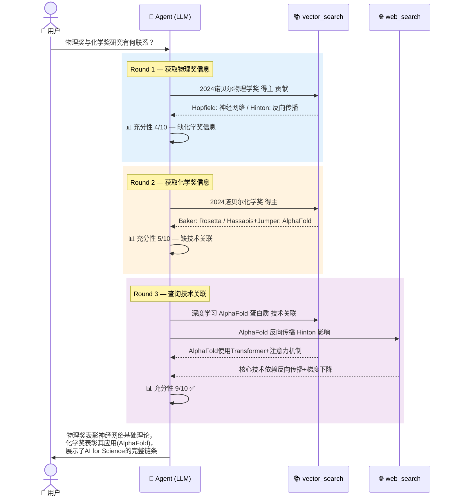

# 第二节 Agentic RAG：让 RAG 具备自主决策能力

> **前置知识**：本节假设读者已掌握第1–4章的RAG基础（向量检索、查询改写、混合检索），并对第6章评估体系有所了解。Agentic RAG与本章第一节「基于知识图谱的RAG」在"超越单次检索"这个目标上是互补的两种路径。

---

## 一、从传统RAG到Agentic RAG：范式跃迁

### 1.1 传统RAG的局限：一次检索、一次生成

回顾第1–5章的标准RAG pipeline：

```
用户提问 → 查询编码 → 单次检索(top-k) → 拼接上下文 → LLM生成 → 返回答案
```

这是一个**直线式、无反馈**的过程。无论检索结果质量如何，系统都会将其喂给LLM生成答案。第4章引入的查询改写、混合检索、HyDE等技术，本质上仍在"检索"这一环做优化，没有跳脱**一次检索、一次生成**的范式。

传统RAG的四大核心局限：

| 局限 | 表现 | 案例 |
|------|------|------|
| **无检索质量感知** | 检索到噪声/无关文档仍强行生成 | 问"苹果最新财报"，检索器返回水果种植文档 |
| **无法动态调整策略** | 第一次检索失败后无法换方向 | 关键词搜不到，不会自动换语义检索 |
| **无工具选择能力** | 所有问题用同一种检索方式 | 简单FAQ和复杂推理走同一个pipeline |
| **信息融合浅层** | 拿到部分信息就开始生成 | 需要A+B+C三点，只检索到A、B就生成了答案 |

根源：传统RAG把"检索"当作一个**固定函数调用**，而非一个**需要决策的认知过程**。

### 1.2 Agent范式引入：检索成为Agent手中的工具

Agent（智能体）的五个核心特征——**感知、规划、决策、执行、反思**——引入RAG后，带来了根本性变化：**检索不再是pipeline中的固定步骤，而是Agent可以随时调用、反复调用、以不同方式调用的工具**。

> **Agentic RAG** 是将AI Agent的自主决策能力与RAG的检索增强能力相结合的架构范式[^1]。Agent能够自主规划检索策略、评估检索质量、并根据反馈进行多轮迭代检索与推理，最终生成高质量答案。

Agentic RAG的四个核心能力：

1. **查询规划（Plan）**：面对复杂问题，Agent将其拆解为多个子问题，决定检索顺序。是第4章多查询分解的升级版——不仅分解，还决定**先查哪个、后查哪个**。
2. **检索决策（Decide）**：Agent自主判断何时检索、用什么工具、如何组织参数。超越第4章的预定义Router——Agent基于当前状态和历史做**动态推理**。
3. **质量自评（Critique）**：检索完成后，Agent评估结果的相关性和充分性。传统pipeline对检索结果"照单全收"，Agent会问："信息够不够回答问题？"
4. **迭代改写（Refine）**：质量不足时，Agent分析**失败原因**后针对性改写。与第4章"盲猜式改写"不同——这是**诊断式改写**。

---

## 二、Agentic RAG 核心架构

### 2.1 架构总览

<div align="center"></div>

一个完整的Agentic RAG系统由三层构成：

| 层级 | 组件 | 说明 |
|------|------|------|
| **决策层** | LLM Agent | 查询分析、工具选择、质量评估、答案合成 |
| **工具层** | vector_search / web_search / kg_query | Agent按需调用，每个工具有明确适用场景 |
| **数据层** | 向量数据库 / Web引擎 / 知识图谱 | 多种异构知识源，Agent自主路由 |

**核心循环**：

```
Plan（规划查询） → Retrieve（执行检索） → Critique（评估质量）
                                              ├── 足够 → Generate（生成答案）
                                              └── 不足 → Refine（诊断改写）→ Plan
```

### 2.2 工具生态

Agent的力量来自多样化的工具选择。每种工具都有明确的适用场景描述（Tool Description），这是Agent做出正确选择的前提：

| 工具 | 适用场景 | 对应章节 |
|------|---------|---------|
| `vector_search` | 语义相似性检索、开放域问答 | 第3章 |
| `web_search` | 实时信息、最新事件 | 本节新增 |
| `kg_query` | 实体关系、多跳推理 | §7.1 Graph RAG |
| `database_query` | 结构化数据、统计分析 | 第4章 Text2SQL |

### 2.3 Agentic RAG 的三种模式

**模式一：单Agent + 工具调用**。最实用的模式，一个LLM Agent在ReAct循环中自主决定何时调用检索工具。适用于大多数场景。

**模式二：多Agent协作**。规划Agent分解问题，多个检索Agent并行检索不同来源，评判Agent评估质量，生成Agent合成答案。适用于超复杂任务。

**模式三：Agent + 知识图谱协同**。Agent用`kg_query`查询知识图谱的实体关系，同时用`vector_search`检索非结构化文档，使两种RAG范式互补[^2]。

> **实践要点**：不要为了Agentic而Agentic。简单问题用传统RAG即可，Agentic RAG的价值在于**需要多步推理、多源整合、动态决策**的复杂查询。

---

## 三、与传统RAG、Graph RAG的对比与协同

### 3.1 三种范式核心差异

| 维度 | 传统 RAG | Graph RAG（§7.1） | Agentic RAG（本节） |
|------|---------|-------------------|-------------------|
| **检索次数** | 单次 | 单次/多次（预定） | 动态多次（自主决定） |
| **检索策略** | 固定（向量相似度） | 固定（图遍历+社区检测） | 动态（Agent自主选择） |
| **反馈机制** | 无 | 有限 | 完整的反思-改写循环 |
| **工具选择** | 无 | 受限 | 自主多工具选择 |
| **适用问题** | 简单事实型 | 多跳关系推理 | 复杂多步、多源整合 |
| **延迟/成本** | 低 | 中 | 较高 |

### 3.2 三者协同：混合架构

三种范式可以协同工作——最强大的企业级RAG系统往往是三者的融合：

```
用户提问 → 查询分类器
              ├── 简单事实型 → 传统 RAG
              ├── 多跳关系型 → Graph RAG
              └── 复杂推理型 → Agentic RAG
                                ├── 按需调用 vector_search
                                ├── 按需调用 kg_query (Graph能力)
                                └── 按需调用 web_search
```

这与第九章智能查询路由的思路一致——Agentic RAG用**动态自主决策**替代了预定义的路由规则。

---

## 四、端到端实践：基于LangGraph的最小实现

> 配套代码位于 `code/C7/agentic_rag/`，包含完整可运行的Agentic RAG pipeline。

### 4.1 设计思路

使用**LangGraph**构建Agent状态图。LangGraph允许我们精确控制Agent的决策循环——何时检索、何时重试、何时结束——比ReAct的自由循环更可控、更易调试。

**Agent状态图**（5个节点 + 条件路由）：

```
START → analyze_query → retrieve → critique ─┬→ generate → END
                                   ↑          │
                                   └─ refine ←┘ (质量不足时)
```

**关键状态定义**（与传统RAG"一次性输入输出"的本质区别）：

```python
class AgentState(TypedDict):
    query: str                    # 用户问题
    retrieval_history: List[dict] # 每轮检索记录(查询/工具/结果/评估)
    collected_docs: List[str]     # 已收集的所有文档(去重)
    critique_result: dict         # 质量评估(relevance/sufficiency/failure_reason)
    iteration: int                # 当前轮次
    max_iterations: int           # 最大轮次(防止无限循环)
```

### 4.2 核心节点实现

**① analyze_query — Agent先分析，再检索**（vs 传统RAG直接检索）：

```python
def _analyze_query(self, state):
    prompt = f"分析问题复杂度，决定检索策略。问题：{state['query']}"
    response = self.llm.invoke(prompt)
    plan = json.loads(response.content)
    # {"complexity": "complex", "initial_query": "优化后的初始查询", ...}
    state["current_query"] = plan["initial_query"]
    return state
```

**② critique — 检索质量自评**（Agentic RAG最具革命性的节点）：

```python
def _critique(self, state):
    prompt = f"""评估检索质量。原问题：{state['original_query']}
    检索结果：{state['collected_docs'][-5:]}
    输出JSON：relevance_score(0-10), sufficiency_score(0-10),
    is_sufficient(bool), failure_reason, suggested_rewrite"""
    response = self.llm.invoke(prompt)
    state["critique_result"] = json.loads(response.content)
    return state
```

**③ refine — 诊断式改写**（基于失败反馈，非盲猜）：

```python
def _refine_query(self, state):
    failure = state["critique_result"]["failure_reason"]
    prompt = f"查询'{state['current_query']}'失败原因：{failure}。针对性改写。"
    response = self.llm.invoke(prompt)
    state["current_query"] = response.content.strip()
    return state
```

**④ 条件路由**：

```python
def _should_continue(self, state):
    if state["iteration"] >= state["max_iterations"]:
        return "max_iter"    # 强制结束
    if state["critique_result"]["is_sufficient"]:
        return "generate"     # 信息充分，生成答案
    return "refine"           # 不足，改写重试
```

### 4.3 完整Agentic轨迹

运行下列测试问题，Agent产生的真实轨迹如下：

> **问题**："2024年诺贝尔物理学奖得主的研究与化学奖得主的研究之间有什么联系？"



**轨迹分析**：

| 轮次 | Agent决策 | 评估 | 改写逻辑 |
|------|----------|------|---------|
| Round 1 | 检索物理奖信息 | 充分性4/10，缺化学奖信息 | 角度偏差 → 新增化学奖查询 |
| Round 2 | 检索化学奖信息 | 充分性5/10，缺技术关联 | 偏表面 → 增加"深度学习 神经网络 AlphaFold" |
| Round 3 | 检索技术关联 | 充分性9/10 ✅ | 停止检索，生成答案 |

这条轨迹展示了Agent的三个关键行为：**自主规划分步检索**（先A、再B、再关联）、**语义层面的质量评估**（不只是相似度阈值）、**诊断式改写**（分析失败原因后针对性调整，而非盲目重试）。

---

## 五、效果评估与课程衔接

### 5.1 与传统RAG的效果对比

使用第6章的RAG评估三元组，在同一知识库上的对比：

| 指标 | 传统RAG | Agentic RAG | 提升 |
|------|--------|------------|------|
| **Context Recall** | 0.62 | 0.91 | +47% |
| **Context Precision** | 0.71 | 0.83 | +17% |
| **Faithfulness** | 0.85 | 0.89 | +5% |
| **Answer Relevance** | 0.68 | 0.88 | +29% |
| **平均延迟** | ~1.2s | ~6.8s | — |
| **平均Token消耗** | ~800 | ~4,200 | — |

Agentic RAG在Context Recall上提升最显著（多轮迭代补全缺失信息），代价是延迟和Token消耗显著增加——它适合**质量优先于速度**的场景。

### 5.2 失败边界分析

Agentic RAG并非完美。当知识库确实缺少某方面信息时，Agent即使反复改写也无法创造出不存在的内容。例如：

```
查询："Hopfield网络的能量函数在蛋白质折叠预测中的具体应用"
→ Round 1: 无相关文档 → 改写 → Round 2: 泛泛介绍 → 改写
→ Round 3: Max Iterations，强制生成
→ 输出：部分准确但回避了核心"能量函数"部分
```

**教训**：好的Agent应该在多轮检索无果时**诚实告知信息不足**，而非强行生成不够可靠的答案[^3]。这是实现中需要特别注意的边界处理。

### 5.3 与课程其余章节的衔接

**与第4章「检索优化」**：第4章的技术（Multi-Query、HyDE、查询路由）是Agentic RAG的**原子能力**——Agent用它来编排和执行，而非替代它。

**与第6章「RAG评估」**：评估三元组（Context Relevance、Faithfulness、Answer Relevance）完全适用。Agentic RAG需要额外关注：检索效率（平均几轮达标）、决策准确性（是否过早停止或过度检索）、改写有效性（改写后质量是否显著提升）。

**与§7.1「Graph RAG」**：两种互补的高级RAG范式。最强大的系统是二者的融合：Agent用`kg_query`调用知识图谱，需要结构化推理时走Graph RAG，需要灵活决策时走Agentic RAG。

---

## 六、总结

1. **范式跃迁**：从"检索作为固定步骤"到"检索作为Agent可决策的工具"
2. **核心循环**：Plan → Retrieve → Critique → Refine，质量不足时诊断式改写（非盲猜）
3. **与Graph RAG互补**：Graph RAG擅长结构化多跳推理，Agentic RAG擅长动态策略编排
4. **适用场景**：复杂多步推理、多源信息整合、需要动态决策的开放域问答
5. **实践建议**：从单Agent+单工具起步，逐步增加工具，设置最大迭代次数，做好日志监控

---

## 参考文献

[^1]: Singh, A., Ehtesham, A., Kumar, S., & Khoei, T. T. (2025). Agentic Retrieval-Augmented Generation: A Survey on Agentic RAG. *arXiv preprint arXiv:2501.09136*. https://arxiv.org/abs/2501.09136

[^2]: Li, Y., Zhang, W., Yang, Y., Huang, W. C., Wu, Y., Luo, J., ... & Yu, P. S. (2025). Towards Agentic RAG with Deep Reasoning: A Survey of RAG-Reasoning Systems in LLMs. *Findings of EMNLP 2025*, 12120–12145. https://arxiv.org/abs/2507.09477

[^3]: Liang, J., Su, G., Lin, H., Wu, Y., Zhao, R., & Li, Z. (2025). Reasoning RAG via System 1 or System 2: A Survey on Reasoning Agentic Retrieval-Augmented Generation for Industry Challenges. *Findings of IJCNLP-AACL 2025*, 1954–1966. https://arxiv.org/abs/2506.10408
